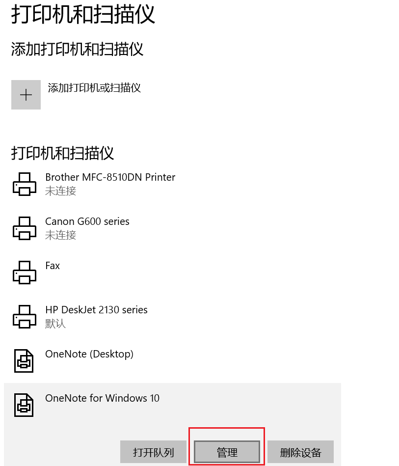
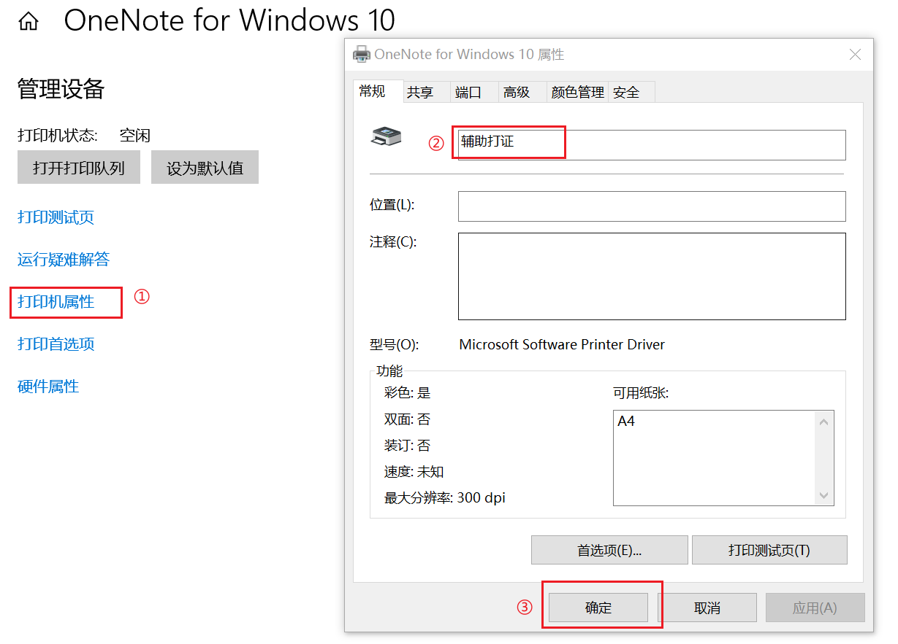
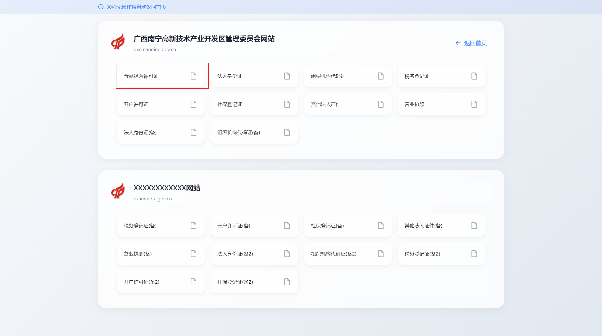

## 使用流程

### 1. 创建虚拟环境
终端运行
`python -m venv venv_name`
### 2. 激活虚拟环境
等待虚拟环境创建完成后激活虚拟环境
`venv_name\Script\activate`
### 3. 安装依赖
`pip install -r requirements.txt`
### 4. 设置本地打印机名称
* 打开打印机和扫描仪设置界面，找到要使用的打印机，

* 修改打印机名称为“辅助打证”

### 5. 运行代码
终端运行
`python app.py`

***

## 注意事项
1. 目前只有法人登录的第一个证件类型（食品安全许可证）可以正常使用。
   
2. 登录的账号密码：
`账号：92450100MAEL5HKP7D   密码：Aa123456`
1. 单个账号连续5次密码错误会被锁定